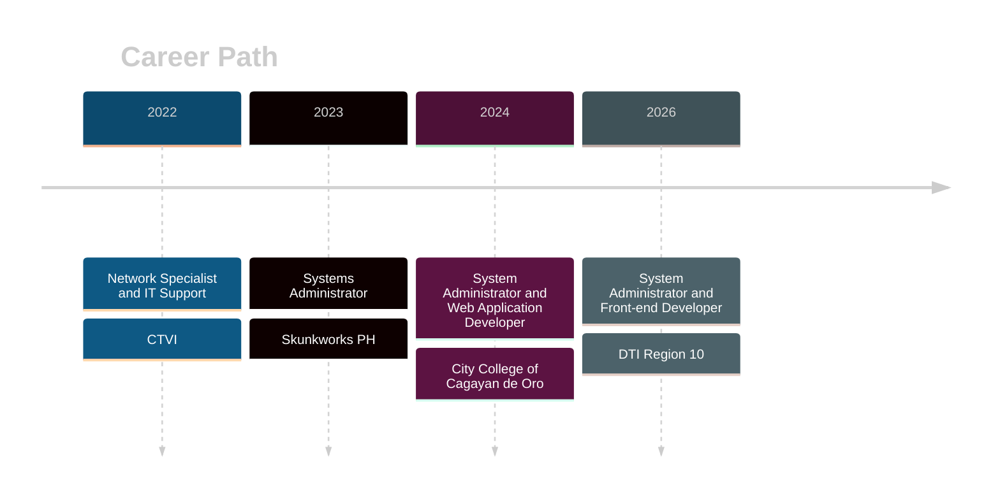

<!-- ═══════════════════════════════════════════════════════════════
     FHEL.DEV — GitHub Profile README  (github.com/fhelcraft)
     Content synced with https://fhel-dev.vercel.app
     Single file · no local assets · renders natively on GitHub
     ═══════════════════════════════════════════════════════════════ -->

<div align="center">


<a href="https://fhel-dev.vercel.app/">
  
</a>

<br/>


<br/><br/>

<a href="https://fhel-dev.vercel.app/"></a>
<a href="https://github.com/fhelcraft"></a>
<a href="mailto:fhelfeliciano@gmail.com"></a>

</div>

<br/>

---

## `> whoami`

```console
fhel@dev:~$ whoami
Fhel Jhon V. Feliciano — System Administrator & Web Developer

fhel@dev:~$ cat focus.txt
Core focus  : Web development
Operations  : System support
Approach    : Practical solutions

fhel@dev:~$ cat mission.txt
I build digital systems that help people work better.
```

I work at the intersection of **system administration** and **web development**: helping organizations and teams keep their digital systems running smoothly, while building practical tools that make daily work easier. With almost four years of experience, I've supported network, system operations and developed web applications, and helped improve how people access and use information across different workflows.

<div align="center">

<table>
<tr>
<td align="center" width="33%"><h2>4+</h2><sub>YEARS IN IT & WEB WORK</sub></td>
<td align="center" width="33%"><h2>5+</h2><sub>SYSTEMS BUILT OR IMPROVED</sub></td>
<td align="center" width="33%"><h2>24/7</h2><sub>MINDSET FOR PRACTICAL SUPPORT</sub></td>
</tr>
</table>

</div>

---

## `> skills`

<div align="center">

**`// FRAMEWORKS · LIBRARIES · LANGUAGES`**


<br/><br/>

**`// DATABASES`**


<br/><br/>

**`// TOOLS`**


<br/>


<br/><br/>

**`// GENERAL`**


</div>

---

## `> experience`



<table>
<tr>
<td width="30%" valign="top">

**System Administrator | Front-end Developer**<br/>
`Mar 2026 – Present`<br/>
🏛️ Department of Trade and Industry – Region 10

</td>
<td valign="top">

- Maintain office systems, network infrastructure, servers, security devices, and endpoint computers to keep daily operations stable and secure.
- Build and improve responsive web interfaces and internal digital tools that support day-to-day workflows and public services.
- Provide technical troubleshooting, system deployment, preventive maintenance, and user support for regional office personnel.

</td>
</tr>
<tr>
<td width="30%" valign="top">

**System Administrator | Web Application Developer**<br/>
`Feb 2024 – Mar 2026`<br/>
🎓 City College of Cagayan de Oro

</td>
<td valign="top">

- Developed and maintained institutional web applications used by students, faculty, and staff.
- Built and deployed several systems, including the official college website, SmartChive document repository, Attendium attendance system, and Courseware LMS platform.
- Improved administrative processes by creating tools that reduced repetitive work and made information easier to access.
- Provided troubleshooting and support for system issues, network connectivity, and printer services to maintain reliable operations.

</td>
</tr>
<tr>
<td width="30%" valign="top">

**Systems Administrator**<br/>
`Aug 2023 – Feb 2024`<br/>
🖥️ Skunkworks PH

</td>
<td valign="top">

- Managed system infrastructure to keep servers, network services, and connected devices operating reliably.
- Monitored infrastructure health, resolved operational issues, and supported updates and maintenance tasks to minimize downtime.
- Assisted in testing and deploying technology solutions in live environments to ensure they worked properly and met operational needs.

</td>
</tr>
<tr>
<td width="30%" valign="top">

**Network Specialist / IT Support**<br/>
`Oct 2022 – Aug 2023`<br/>
📡 Cagayan de Oro Technical Vocational Institute

</td>
<td valign="top">

- Installed and configured network access points and multi-WAN setups to improve connectivity across campus buildings.
- Helped design and implement college network infrastructure to support academic and administrative operations.
- Resolved day-to-day network and device issues while supporting faculty and staff with technical guidance.

</td>
</tr>
</table>

---

## `> projects`

*Production systems I've built and contributed.*

<table>
<tr>
<td width="50%" valign="top">

### NorMInvest
`FRONT END DEVELOPER`

An investment portal connecting businesses with opportunities, services, incentives, and support across Northern Mindanao.

<a href="https://norminvest.dti.gov.ph"></a>

</td>
<td width="50%" valign="top">

### CRCC LMS
`FRONT END DEVELOPER`

A learning management system for Christ the Rock Christian Church.

<a href="https://demo.crccph.org"></a>

</td>
</tr>
<tr>
<td width="50%" valign="top">

### Island Hopper Landscape Supplies
`WORDPRESS DEVELOPER`

A company website presenting landscape materials, product categories, and outdoor project supplies for Long Island customers.

<a href="https://islandhopperlandscape.com"></a>

</td>
<td width="50%" valign="top">

### City College of Cagayan de Oro Website
`FRONT END DEVELOPER`

The official college website bringing academic programs, campus updates, and essential information together for students, faculty, and the community.

<a href="https://citycollegecdo.edu.ph"></a>

</td>
</tr>
<tr>
<td width="50%" valign="top">

### SmartChive
`FULL STACK DEVELOPER`

A digital records platform that helps college departments organize, store, and retrieve institutional documents in a centralized place.

<a href="https://smartchive.citycollegecdo.edu.ph"></a>

</td>
<td width="50%" valign="top">

### Attendium
`FRONT END DEVELOPER`

A faculty attendance platform for recording daily attendance and giving administrators a clearer view of staff attendance records.

<a href="https://attendium.citycollegecdo.edu.ph"></a>

</td>
</tr>
<tr>
<td width="50%" valign="top">

### Courseware
`FRONT END DEVELOPER`

An online learning platform where students can access course materials and engage with digital learning resources.

<a href="https://courseware.citycollegecdo.edu.ph"></a>

</td>
<td width="50%" valign="middle" align="center">

**See the full write-ups**

<a href="https://fhel-dev.vercel.app/#projects"></a>

</td>
</tr>
</table>

---

## `> education`

<table>
<tr>
<td width="50%" valign="top">

**🎓 University of Science and Technology of Southern Philippines**<br/>
Bachelor of Science in Information Technology<br/>
`Jun 2018 – Aug 2022`

- Capstone: Barangay Appointment Scheduler System with QR Code Scanner
- 1st Honor Dean's Lister (2022), 4th Year
- 2nd Honor Dean's Lister (2021), 3rd Year

**📘 Golden Heritage Institute**<br/>
Professional Education Units (18 Units)<br/>
`Jun 2025 – Nov 2025`

</td>
<td width="50%" valign="top">

**🛡️ Certifications**

- CISCO: CyberOps Associate
- Intro to Networks and Intro to IoT

**🏆 Awards — City College of Cagayan de Oro**

- Top 1 Administrative Employee (2025)
- Top 2 Job Order Employee (2024)
- Top 1 Employee (2023)

**📄 Professional License & Eligibility**

- PRC: Licensed Professional Teacher (2026)
- CSC: Fire Officer Examination (2026)
- NAPOLCOM: National Police Examination (2026)

**🌐 Languages:** English · Filipino

</td>
</tr>
</table>

---

## `> github-stats`

<div align="center">


<br/>


</div>

---

## `> contact`

<div align="center">

*Let's work together.*

<br/>

<a href="mailto:fhelfeliciano@gmail.com">
  
</a>
<a href="https://fhel-dev.vercel.app/">
  
</a>
<a href="https://github.com/fhelcraft">
  
</a>

<br/><br/>

```text
Dependable systems, practical tools, and user-friendly digital experiences that support real work.
```


</div>
