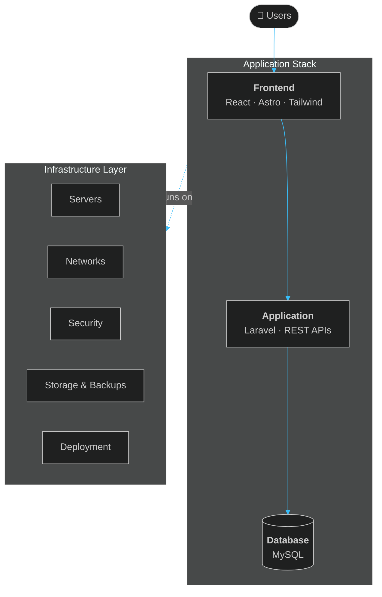

<!-- ═══════════════════════════════════════════════════════════════
     FHEL.DEV — GitHub Profile README  (github.com/fhelcraft)
     Single file · no local assets · renders natively on GitHub
     ═══════════════════════════════════════════════════════════════ -->

<div align="center">


<a href="https://git.io/typing-svg">
  
</a>

<br/>


<br/><br/>

<a href="https://fhel-dev.vercel.app/"></a>
<a href="https://github.com/fhelcraft"></a>

</div>

<br/>

---

## `> whoami`

```console
fhel@dev:~$ whoami
Fhel Jhon V. Feliciano — IT Systems Professional

fhel@dev:~$ cat focus.txt
Front End Development · Web Applications · System Administration · Networking

fhel@dev:~$ echo $PHILOSOPHY
I don't only build interfaces. I think about the systems behind them.
```

I build web applications **and** work with the servers, networks, storage, security and deployment environments that keep them running. The problems I enjoy most are the practical ones, where **software meets infrastructure**.

<br/>

<table>
<tr>
<td width="50%" valign="top">

**`/software`**
```text
├── Front End Development
├── Web Applications
├── Laravel / PHP
├── React / Astro
├── MySQL
└── WordPress
```

</td>
<td width="50%" valign="top">

**`/systems`**
```text
├── System Administration
├── Networking
├── Server Management
├── NAS / Storage
├── Backup & Recovery
├── Security
└── Deployment
```

</td>
</tr>
</table>

---

## `> tech-stack`

<div align="center">

**`// SOFTWARE DEVELOPMENT`**


<br/><br/>

**`// SYSTEMS & INFRASTRUCTURE`**


<br/>


<br/><br/>

**`// TOOLS`**


<br/>


</div>

---

## `> featured-project`

<table>
<tr>
<td width="62%" valign="top">

### ⛽ GasBantay-CDO
**CDO Gas Price Map**

A live, map-based web app for tracking gas prices around Cagayan de Oro. Built as a Laravel application with a dedicated map front end and deployed on Vercel.


`Web App` · `Maps` · `Laravel` · `Deployment`

<a href="https://gas-bantay-cdo.vercel.app"></a>
<a href="https://github.com/fhelcraft/GasBantay-CDO"></a>

</td>
<td width="38%" valign="middle" align="center">

<a href="https://github.com/fhelcraft/GasBantay-CDO">
  
</a>

</td>
</tr>
</table>

---

## `> selected-work`

<table>
<tr>
<td width="50%" valign="top">

### 🏢 IACT
**Investment Assistance Center**

A government-oriented web platform for investment assistance: location information, mapping, facilities, cost guidance and interactive tools.


`Frontend` · `GIS / Maps` · `UI` · `Deployment`

</td>
<td width="50%" valign="top">

### 📚 Courseware LMS
**Learning management platform**

Centralizes courseware, learning workflows, assessments and learner support, with AI integration.


`Full-stack` · `Database` · `API Integration`

</td>
</tr>
<tr>
<td width="50%" valign="top">

### ⛪ Church LMS
**Organizational learning system**

Structured learning content and administrative workflows built for an organizational client.


`Full-stack` · `UI` · `Architecture`

</td>
<td width="50%" valign="top">

### 🖥️ IT Infrastructure & Systems
**Hands-on operations**

Servers, networking, NAS and storage, backup systems, security infrastructure, deployment and day-to-day IT operations.


`SysAdmin` · `Networking` · `Backup` · `Troubleshooting`

</td>
</tr>
</table>

<div align="center">

<a href="https://fhel-dev.vercel.app/"></a>

</div>

---

## `> architecture`

I think in layers, and about everything around them.



---

## `> current-focus`

```text
[✓] Build practical web applications
[✓] Improve system administration skills
[✓] Work with infrastructure and networking
[→] Improve automation
[→] Explore new technologies
[→] Build better systems
```

---

## `> github-stats`

<div align="center">


<br/>


</div>

---

## `> connect`

<div align="center">

<a href="https://fhel-dev.vercel.app/">
  
</a>
<a href="https://github.com/fhelcraft">
  
</a>

<br/><br/>

```text
Servers, networks, and code — that's the balance.
```


</div>
